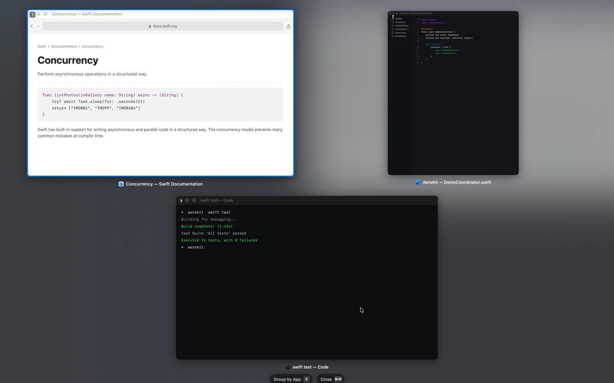
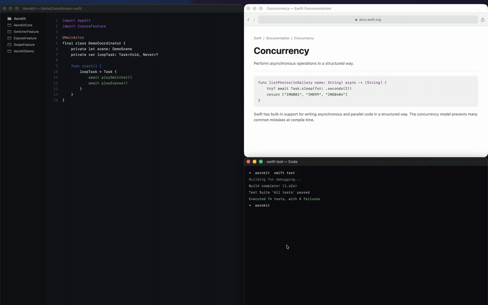
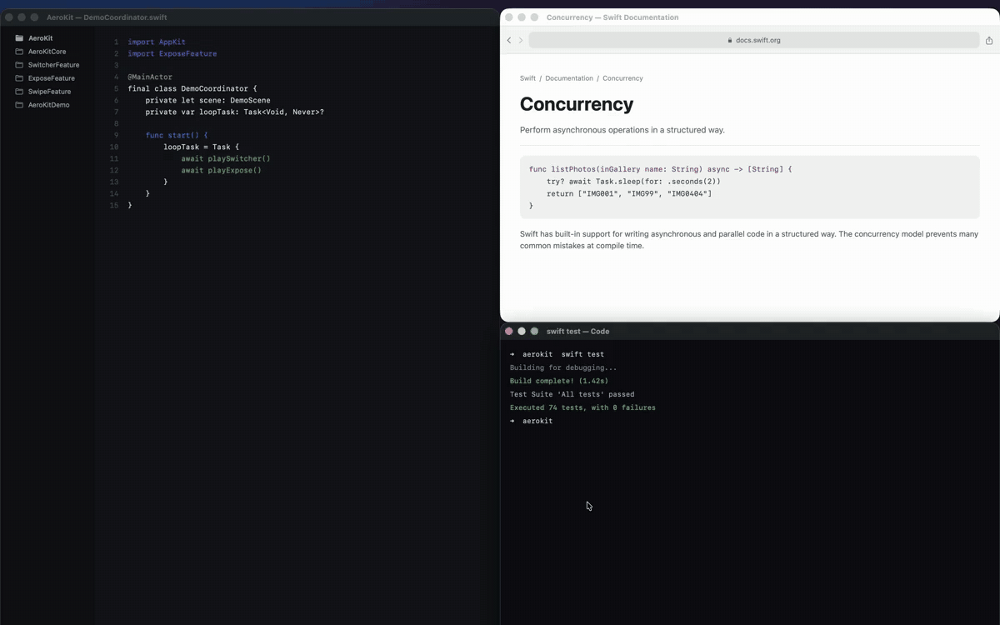
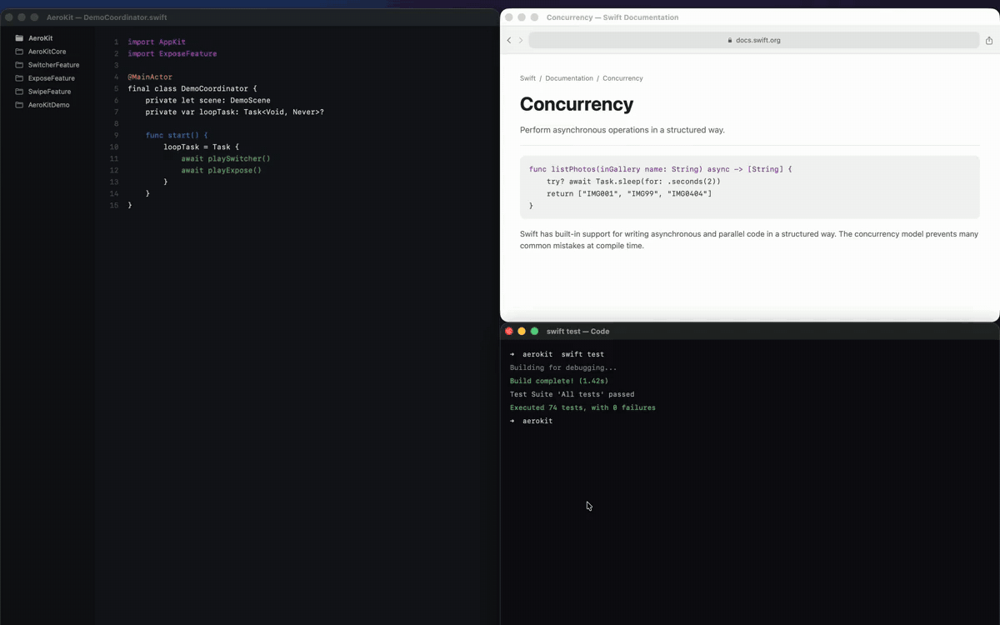

# aerokit

[](https://github.com/jomatsu/aerokit/actions/workflows/ci.yml)

A visual companion layer for [AeroSpace](https://github.com/nikitabobko/AeroSpace).

AeroKit adds a Cmd-Tab-style workspace switcher, spatial Exposé and App Exposé,
and three-finger workspace navigation without changing the AeroSpace layout.



[▶ Watch the 29-second demo](docs/demo/aerokit-demo.mp4)

- Workspace Switcher with snapshot previews
- Exposé and App Exposé with spatial window layout
- Three-finger workspace switching

## Features

### Workspace Switcher



Switch AeroSpace workspaces like apps in Cmd-Tab, with snapshots and app icons
that make the destination recognizable before switching.

### Exposé and App Exposé



See the focused workspace as a spatial overview, or find every window of the
focused app across workspaces, then jump directly to the one you need.

### Trackpad Swipe



Move between workspaces with a natural three-finger swipe and a compact HUD
that follows the gesture.

## Requirements

- macOS 14 (Sonoma) or later
- [AeroSpace](https://github.com/nikitabobko/AeroSpace) installed and running
  (`brew install --cask nikitabobko/tap/aerospace`)
- **Screen Recording** permission for window previews (the app works without it,
  minus previews)

## Install

Build and install from source:

```sh
git clone https://github.com/jomatsu/aerokit.git
cd aerokit/packages/app
scripts/install-app.sh
```

This builds a release binary and wraps it into `~/Applications/AeroKit.app`. On
first launch the app registers itself as a login item (System Settings › General
› Login Items), toggleable from the settings window.

<!-- TODO: once the Homebrew tap is live:
```sh
brew install --cask jomatsu/tap/aerokit
```
-->

See [`packages/app`](packages/app) for features, default hotkeys, and CLI flags.

## Packages

| Package | Description |
| --- | --- |
| [`packages/app`](packages/app) | AeroKit — menu-bar app bundling the workspace switcher (snapshot previews) and the Exposé-style window overview |

## Development

```sh
make bootstrap  # install SwiftFormat, SwiftLint and AeroSpace through Homebrew
make format     # format all packages
make lint       # lint all packages
make build      # build all packages
make test       # test all packages
make check      # lint + build + test
```

Formatting and linting rules are shared across packages via the root `.swiftformat` and `.swiftlint.yml`.

## License

[MIT](LICENSE)
